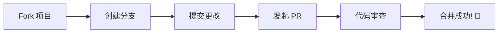

<div align="center">

# 🌟 Turnip Nav

**一个极致优雅的个人导航页面**

*现代化 · 可定制 · 高性能 · 可拖拽*

[](https://react.dev/)
[](https://www.typescriptlang.org/)
[](https://ant.design/)
[](./LICENSE)

[🚀 在线演示](#) · [📖 文档](./docs/THEME_SYSTEM.md) · [🐛 报告问题](#) · [💡 功能建议](#)

---


*Turnip Nav 让你的浏览器主页独一无二*

</div>

---

## ✨ 为什么选择 Turnip Nav？

<table>
<tr>
<td width="50%">

### 🎨 极致主题体验

- **7+ 种精心设计的预设主题**
- **RGBA 颜色自定义** - 每一个像素都由你掌控
- **智能暗黑模式** - 跟随时间自动切换
- **无缝主题切换** - 流畅的过渡动画
- **可视化主题编辑器** - 所见即所得

</td>
<td width="50%">

### 📋 全功能待办清单

- **任务优先级管理** - 高 / 中 / 低三级分类
- **任务分类系统** - 工作 / 生活 / 学习
- **截止日期设置** - 日期选择器支持
- **批量操作** - 一键全部标记完成 / 清空已完成
- **Markdown 导出** - 待办事项导出分享
- **可拖拽面板** - 自由定位 + 边缘停靠 + 自动折叠

</td>
</tr>
<tr>
<td width="50%">

### 🔍 强大的搜索能力

- **多搜索引擎支持** - 百度、Google、Bing...
- **自定义引擎** - 添加你常用的搜索源
- **快捷切换** - 一键切换，效率翻倍
- **搜索历史** - 记录最近20条搜索记录
- **快捷键** - `Ctrl+K` 打开面板，`Ctrl+T` 切换主题

</td>
<td width="50%">

### 🧩 可拖拽桌面组件

- **实时时钟组件** - 显示日期时间，自由拖动定位
- **更新日志铃铛** - 版本更新提醒，未读红点提示
- **待办清单入口** - 快速打开/关闭待办面板
- **位置持久化** - 刷新页面后位置不丢失
- **防误触设计** - 拖拽与点击智能区分（5px阈值）

</td>
</tr>
<tr>
<td width="50%">

### 💾 灵活的存储方案

- **三重存储策略** - localStorage / IndexedDB / 智能选择
- **选择性清理** - 精确控制数据清除
- **一键备份** - 数据安全无忧
- **偏好记忆** - 你的选择永远保留
- **大数据优化** - 智能分配存储位置

</td>
<td width="50%">

### 📊 完善的配置管理

- **版本控制** - 每次修改都有记录
- **一键回滚** - 误操作？轻松恢复
- **导入导出** - 配置随身携带
- **实时预览** - 所见即所得
- **版本对比** - 差异一目了然

</td>
</tr>
</table>

---

## 🚀 快速开始

### 📦 安装

```bash
# 克隆项目
git clone https://github.com/Turnip1202/Turnip1202.github.io.git

# 进入目录
cd Turnip1202.github.io

# 安装依赖
pnpm install
```

### 🎮 启动

```bash
# 开发模式 (端口 3000)
pnpm dev

# 构建生产版本
pnpm build

# 预览生产版本
pnpm preview

# 代码检查与格式化
pnpm check
pnpm format
```

---

## 🎯 功能一览

<table>
<thead>
<tr>
<th>功能模块</th>
<th>描述</th>
<th>状态</th>
</tr>
</thead>
<tbody>
<tr>
<td>🎨 主题系统 V2</td>
<td>7种预设主题 + RGBA自定义 + 暗黑模式 + 可视化编辑器</td>
<td>✅ 已完成</td>
</tr>
<tr>
<td>📋 待办清单系统</td>
<td>优先级/分类/截止日期 + 批量操作 + Markdown导出</td>
<td>✅ 已完成</td>
</tr>
<tr>
<td>🧩 可拖拽组件</td>
<td>时钟/铃铛/待办按钮 自由拖拽 + 位置持久化</td>
<td>✅ 已完成</td>
</tr>
<tr>
<td>📦 更新日志</td>
<td>版本更新记录 + 未读提醒 + Modal展示</td>
<td>✅ 已完成</td>
</tr>
<tr>
<td>💾 存储系统</td>
<td>localStorage / IndexedDB / 智能选择</td>
<td>✅ 已完成</td>
</tr>
<tr>
<td>🔍 搜索引擎</td>
<td>多引擎支持 + 自定义引擎 + 搜索历史</td>
</tr>
<tr>
<td>🔗 链接管理</td>
<td>分类管理 + 收藏夹 + 自定义图标</td>
<td>✅ 已完成</td>
</tr>
<tr>
<td>⌨️ 快捷键</td>
<td>Ctrl+K 面板 / Ctrl+T 主题</td>
<td>✅ 已完成</td>
</tr>
<tr>
<td>📊 配置版本</td>
<td>版本控制 + 导入导出 + 对比差异</td>
<td>✅ 已完成</td>
</tr>
<tr>
<td>⚡ PWA 支持</td>
<td>离线访问 + 桌面安装</td>
<td>🔄 计划中</td>
</tr>
</tbody>
</table>

---

## 🏗️ 项目架构

```
src/
├── 📂 components/              # UI 组件
│   ├── 📂 AdminPanel/          # 管理面板
│   │   └── 📂 templates/       # 面板模板（链接/主题/站点/版本/Antd展示）
│   ├── 📂 TodoList/            # 待办清单模块
│   │   ├── DraggablePanel.tsx  # 可拖拽停靠面板
│   │   ├── TodoList.tsx        # 待办列表主组件
│   │   ├── TodoItem.tsx        # 单条待办项
│   │   └── TodoListWidget.tsx  # 待办挂载入口
│   ├── 📂 base/                # 基础组件
│   │   ├── Clock.tsx           # 实时时钟
│   │   ├── SearchBar.tsx       # 搜索栏
│   │   ├── LinkGrid.tsx        # 链接网格
│   │   ├── ThemeSelector.tsx   # 主题选择器
│   │   └── LoadingSpinner.tsx  # 加载动画
│   ├── 📂 common/              # 公共组件
│   │   └── DraggableWidget.tsx # 通用可拖拽容器
│   ├── 📂 theme/               # 主题相关组件
│   │   ├── ThemeEditor.tsx     # 主题编辑器
│   │   ├── RGBAColorPicker.tsx # 颜色选择器
│   │   └── StorageSelector.tsx # 存储方案选择
│   ├── 📂 Layout/              # 布局组件
│   │   └── Background.tsx      # 背景层
│   ├── UpdateLog.tsx           # 更新日志组件
│   └── KeyboardShortcuts.tsx   # 快捷键绑定
├── 📂 contexts/                 # React Context
│   └── ThemeContext.tsx         # 主题上下文
├── 📂 core/                     # 核心模块
│   ├── 📂 config/               # 配置管理 (ConfigManager)
│   ├── 📂 events/               # 事件系统 (EventEmitter)
│   ├── 📂 storage/              # 存储系统 (SmartStorageManager)
│   │   ├── LocalStorageAdapter.ts
│   │   └── IndexedDBAdapter.ts
│   └── 📂 theme/                # 主题管理 (ThemeManagerV2)
├── 📂 hooks/                    # 自定义 Hooks
├── 📂 styles/                   # 样式文件
│   ├── design-tokens.ts         # 设计令牌
│   ├── antd-theme.ts            # Ant Design 主题覆盖
│   └── App.css.ts               # Emotion CSS
├── 📂 types/                    # TypeScript 类型定义
├── 📂 utils/                    # 工具函数
│   ├── 📂 search/               # 搜索历史管理
│   ├── 📂 links/                # 链接管理
│   ├── 📂 site/                 # 站点配置
│   ├── 📂 todo/                 # 待办数据管理
│   ├── 📂 version/              # 版本管理 + 更新日志
│   └── 📂 keyboard/             # 键盘快捷键
├── 📂 config/                   # 应用配置
│   ├── links.ts                 # 链接数据
│   ├── theme.ts                 # 主题配置
│   └── site.ts                  # 站点信息
├── 📂 views/                    # 页面视图
│   └── Main.tsx                 # 主页面
├── App.tsx                      # 应用根组件
└── index.tsx                    # 入口文件
```

---

## 🛠️ 技术栈

<div align="center">

| 技术 | 版本 | 描述 |
|:----:|:----:|:----:|
| [](https://react.dev/) | 19 | 现代化 UI 框架 |
| [](https://www.typescriptlang.org/) | 5.7 | 类型安全 |
| [](https://ant.design/) | 6 | 企业级 UI 组件 |
| [](https://emotion.sh/) | 11 | CSS-in-JS |
| [](https://rsbuild.dev/) | 1 | 高性能构建工具 |
| [](https://biomejs.dev/) | 1.9 | 代码格式化 & Lint |

</div>

---

## 📐 可拖拽组件架构

```
┌─────────────────────────────────────────────┐
│  DraggableWidget (通用拖拽引擎)              │
│  ├─ resolvePosition()    函数型坐标求值      │
│  ├─ loadPosition()       localStorage 读取   │
│  ├─ DRAG_THRESHOLD=5px   防误触阈值          │
│  ├─ 边界限制              Math.max/min        │
│  └─ position 持久化       storageKey → LS     │
│                                             │
│  ┌─ Clock (storageKey: turnip-widget-clock) │
│  ┌─ 待办按钮 (turnip-widget-todo-btn-v2)    │
│  └─ 铃铛 (turnip-widget-updatelog-v2)       │
│                                             │
│  DraggablePanel (独立拖拽面板)               │
│  ├─ z-index: 9999                           │
│  ├─ 边缘停靠 (左/右/上, 阈值50px)             │
│  ├─ 折叠/展开                                │
│  └─ 停靠自动隐藏 (mouseleave 3s)             │
└─────────────────────────────────────────────┘
```

---

## 📖 文档

- 📚 [主题系统文档](./docs/THEME_SYSTEM.md) - 详细的主题系统说明
- 📝 [更新日志](./public/update-logs.json) - 版本更新记录

---

## 📜 版本历史

| 版本 | 日期 | 主要更新 |
|:----:|:----:|----------|
| v1.1.0 | 2026-04-26 | 待办清单系统、可拖拽组件、增强主题系统、智能存储 |
| v1.0.0 | 2026-04-23 | 基础框架：搜索、链接收藏、主题切换、管理面板 |

---

## 🤝 参与贡献

我们欢迎所有形式的贡献！



---

## 🌟 Star History

<div align="center">


*如果这个项目对你有帮助，请给一个 ⭐ Star 支持一下！*

</div>

---

## 📜 许可证

本项目基于 [MIT](./LICENSE) 许可证开源。

---

<div align="center">

**Made with ❤️ by Turnip**

[⬆ 返回顶部](#-turnip-nav)

</div>
