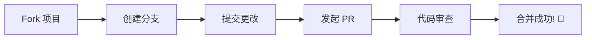

<div align="center">

# 🌟 Turnip Nav

**一个极致优雅的个人导航页面**

*现代化 · 可定制 · 高性能*

[](https://react.dev/)
[](https://www.typescriptlang.org/)
[](https://ant.design/)
[](./LICENSE)

[🚀 在线演示](#) · [📖 文档](./docs/THEME_SYSTEM.md) · [🐛 报告问题](#) · [💡 功能建议](#)

---


*让你的浏览器主页独一无二*

</div>

---

## ✨ 为什么选择 Turnip Nav？

<table>
<tr>
<td width="50%">

### 🎨 极致主题体验

- **7 种精心设计的预设主题**
- **RGBA 颜色自定义** - 每一个像素都由你掌控
- **智能暗黑模式** - 跟随时间自动切换
- **无缝主题切换** - 流畅的过渡动画

</td>
<td width="50%">

### 💾 灵活的存储方案

- **三重存储策略** - localStorage / IndexedDB / 智能选择
- **选择性清理** - 精确控制数据清除
- **一键备份** - 数据安全无忧
- **偏好记忆** - 你的选择永远保留

</td>
</tr>
<tr>
<td width="50%">

### 🔍 强大的搜索能力

- **多搜索引擎支持** - 百度、Google、Bing...
- **自定义引擎** - 添加你常用的搜索源
- **快捷切换** - 一键切换，效率翻倍
- **智能联想** - 搜索建议，快人一步

</td>
<td width="50%">

### 📊 完善的配置管理

- **版本控制** - 每次修改都有记录
- **一键回滚** - 误操作？轻松恢复
- **导入导出** - 配置随身携带
- **实时预览** - 所见即所得

</td>
</tr>
</table>

---

## 🚀 快速开始

### 📦 安装

```bash
# 克隆项目
git clone https://github.com/Turnip1202/Turnip1202.github.io.git

# 进入目录
cd Turnip1202.github.io

# 安装依赖
pnpm install
```

### 🎮 启动

```bash
# 开发模式
pnpm dev

# 构建生产版本
pnpm build

# 预览生产版本
pnpm preview
```

---

## 🎯 功能一览

<table>
<thead>
<tr>
<th>功能模块</th>
<th>描述</th>
<th>状态</th>
</tr>
</thead>
<tbody>
<tr>
<td>🎨 主题系统</td>
<td>7种预设主题 + 自定义颜色 + 暗黑模式</td>
<td>✅ 已完成</td>
</tr>
<tr>
<td>💾 存储系统</td>
<td>localStorage / IndexedDB / 智能选择</td>
<td>✅ 已完成</td>
</tr>
<tr>
<td>🔍 搜索引擎</td>
<td>多引擎支持 + 自定义引擎</td>
<td>✅ 已完成</td>
</tr>
<tr>
<td>🔗 链接管理</td>
<td>分类管理 + 自定义图标</td>
<td>✅ 已完成</td>
</tr>
<tr>
<td>📊 配置版本</td>
<td>版本控制 + 导入导出</td>
<td>✅ 已完成</td>
</tr>
<tr>
<td>⚡ PWA 支持</td>
<td>离线访问 + 桌面安装</td>
<td>🔄 计划中</td>
</tr>
</tbody>
</table>

---

## 🏗️ 项目架构

```
src/
├── 📂 components/        # UI 组件
│   ├── 📂 AdminPanel/   # 管理面板
│   ├── 📂 Layout/       # 布局组件
│   └── 📂 theme/        # 主题组件
├── 📂 contexts/         # React Context
├── 📂 core/             # 核心模块
│   ├── 📂 events/       # 事件系统
│   ├── 📂 storage/      # 存储系统
│   └── 📂 theme/        # 主题管理
├── 📂 types/            # TypeScript 类型
├── 📂 utils/            # 工具函数
└── 📂 views/            # 页面视图
```

---

## 🛠️ 技术栈

<div align="center">

| 技术 | 版本 | 描述 |
|:----:|:----:|:----:|
| [](https://react.dev/) | 19 | 现代化 UI 框架 |
| [](https://www.typescriptlang.org/) | 5.7 | 类型安全 |
| [](https://ant.design/) | 6 | 企业级 UI 组件 |
| [](https://emotion.sh/) | 11 | CSS-in-JS |
| [](https://rsbuild.dev/) | 1 | 高性能构建工具 |

</div>

---

## 📖 文档

- 📚 [主题系统文档](./docs/THEME_SYSTEM.md) - 详细的主题系统说明

---

## 🤝 参与贡献

我们欢迎所有形式的贡献！



---

## 🌟 Star History

<div align="center">


*如果这个项目对你有帮助，请给一个 ⭐ Star 支持一下！*

</div>

---

## 📜 许可证

本项目基于 [MIT](./LICENSE) 许可证开源。

---

<div align="center">

**Made with ❤️ by Turnip**

[⬆ 返回顶部](#-turnip-nav)

</div>
